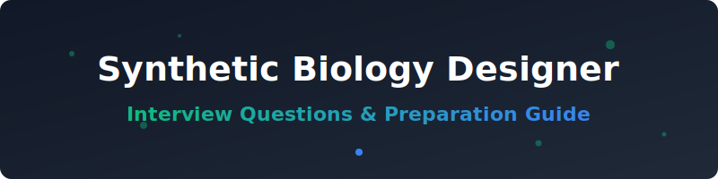

<p align="center">
  
</p>

# 🧬 Synthetic Biology Designer Interview Questions 🔧

🚀 A curated, community-driven collection of interview questions (with model answers, frameworks, and explanations) for **Synthetic Biology Designer / Strain Engineer / Genetic Circuit Designer** roles — spanning industrial biotech 🏭, agricultural biotech 🌾, biomanufacturing 🧪, and academic synthetic biology labs 🏫.

💡 This is not a list of trivia. Every question includes:
- 🎯 **Why interviewers ask it**
- 🛠️ **A model answer or framework**
- 🔍 **Follow-up questions** interviewers commonly use to probe deeper

> 🌱 This is v1. Contributions, corrections, and new questions are very welcome — see [CONTRIBUTING.md](CONTRIBUTING.md).

> ⚠️ **Note on scope:** This repo focuses on the design/engineering side of synthetic biology — genetic parts and circuits, DNA assembly, host engineering, the Design-Build-Test-Learn cycle, and computational design tools. It assumes some existing background in molecular biology and/or genetic engineering. For adjacent, complementary content on the underlying computational/statistical methods, see companion repos on **Computational Biologist**, **Genomics Data Scientist**, and **AI Drug Discovery Scientist** roles. This repo keeps biosafety/biosecurity content at the conceptual and policy level throughout — it does not provide, and will not accept contributions containing, actionable technical detail relevant to engineering harmful biological agents.

---

## 📚 Table of Contents

| # | 🗂️ Category | 📝 What it covers |
|---|----------|-----------------|
| 1 | 🔬 [SynBio Fundamentals & the DBTL Cycle](questions/01-synbio-fundamentals-and-dbtl-cycle.md) | Engineering principles applied to biology, the Design-Build-Test-Learn cycle |
| 2 | 🧩 [Genetic Circuit Design & Parts](questions/02-genetic-circuit-design-and-parts.md) | Promoters, RBS, genetic circuits, orthogonality, standardization |
| 3 | ✂️ [DNA Assembly, Cloning & Genome Editing](questions/03-dna-assembly-cloning-and-genome-editing.md) | Golden Gate, Gibson assembly, CRISPR-based genome engineering |
| 4 | 🦠 [Host Engineering & Metabolic Engineering](questions/04-host-and-metabolic-engineering.md) | Chassis selection, pathway design, flux balance analysis, expression optimization |
| 5 | 💻 [Computational Design Tools & Modeling](questions/05-computational-design-tools-and-modeling.md) | CAD tools for genetic design, RBS/codon optimization, ML-assisted part design |
| 6 | 🧫 [Directed Evolution & High-Throughput Screening](questions/06-directed-evolution-and-screening.md) | Library design, selection strategies, iterating the DBTL cycle at scale |
| 7 | 🛡️ [Biosafety, Biosecurity & Regulatory Considerations](questions/07-biosafety-biosecurity-and-regulatory.md) | Containment, dual-use awareness, GMO regulation, responsible design practices |
| 8 | 🤝 [Behavioral & Case Studies](questions/08-behavioral-and-case-studies.md) | Real-world engineering scenarios, cross-functional collaboration |

Also see: 🔗 [resources.md](resources.md) for external reading, tools, and communities.

---

## 🧭 How to Use This Repo

- 🧬 **Coming from a molecular biology/genetic engineering background?** Prioritize sections 5 and 6 — the goal is building fluency in computational design tools and higher-throughput, more systematic engineering approaches that go beyond traditional one-at-a-time molecular cloning.
- 💻 **Coming from an engineering/CS background moving into synthetic biology?** Prioritize sections 2, 3, and 4 — you'll need working fluency in the molecular biology vocabulary and constraints before your engineering/systems-design instincts translate well into this domain.
- 🏭 **Interviewing at an industrial biomanufacturing company (e.g., producing chemicals, materials, or ingredients via engineered organisms)?** Focus heavily on sections 4 and 6.
- 🤖 **Interviewing at a company building foundational design tools or automation platforms?** Focus heavily on section 5.
- 🚨 **Interviewing for a role touching gene therapy, gene drives, or other high-stakes application areas?** Focus heavily on section 7.

Each question is tagged with a rough difficulty and role-level indicator:
- 🟢 Junior/Associate · 🟡 Mid-level Scientist/Engineer · 🔴 Senior/Principal

---

## 🗂️ Repo Structure

```text
synthetic-biology-designer-interview-questions/
├── README.md                                          ← you are here
├── CONTRIBUTING.md
├── LICENSE
├── resources.md
└── questions/
    ├── 01-synbio-fundamentals-and-dbtl-cycle.md
    ├── 02-genetic-circuit-design-and-parts.md
    ├── 03-dna-assembly-cloning-and-genome-editing.md
    ├── 04-host-and-metabolic-engineering.md
    ├── 05-computational-design-tools-and-modeling.md
    ├── 06-directed-evolution-and-screening.md
    ├── 07-biosafety-biosecurity-and-regulatory.md
    └── 08-behavioral-and-case-studies.md
```

## 🤝 Contributing

✨ PRs are the whole point of this repo. If you were asked a question in a real interview that isn't here, add it! See [CONTRIBUTING.md](CONTRIBUTING.md) for format guidelines — note in particular the biosafety/biosecurity content guidelines, which keep this repo at the conceptual/policy level only.

## 📄 License

📜 Content is available under [MIT License](LICENSE) — use it freely for your own prep, mock interviews, or hiring loops.

## ⭐ Support

🌟 If this helped you land an offer, consider starring the repo and adding the question that stumped you — it might help the next person.

##  Star History
<div align="center">
<a href="https://www.star-history.com/?repos=ishandutta2007%2FAwesome-Synthetic-Biology-Designer-Interview-Questions&type=date&legend=bottom-right">
<picture>
<source media="(prefers-color-scheme: dark)" srcset="https://api.star-history.com/chart?repos=ishandutta2007/Awesome-Synthetic-Biology-Designer-Interview-Questions&type=date&theme=dark&legend=bottom-right" />
<source media="(prefers-color-scheme: light)" srcset="https://api.star-history.com/chart?repos=ishandutta2007/Awesome-Synthetic-Biology-Designer-Interview-Questions&type=date&legend=bottom-right" />

</picture>
</a>
</div>
